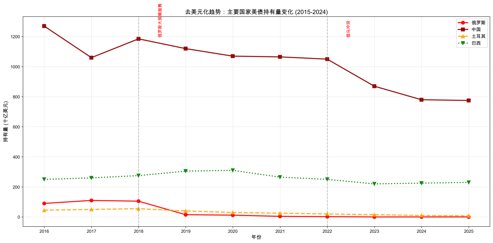
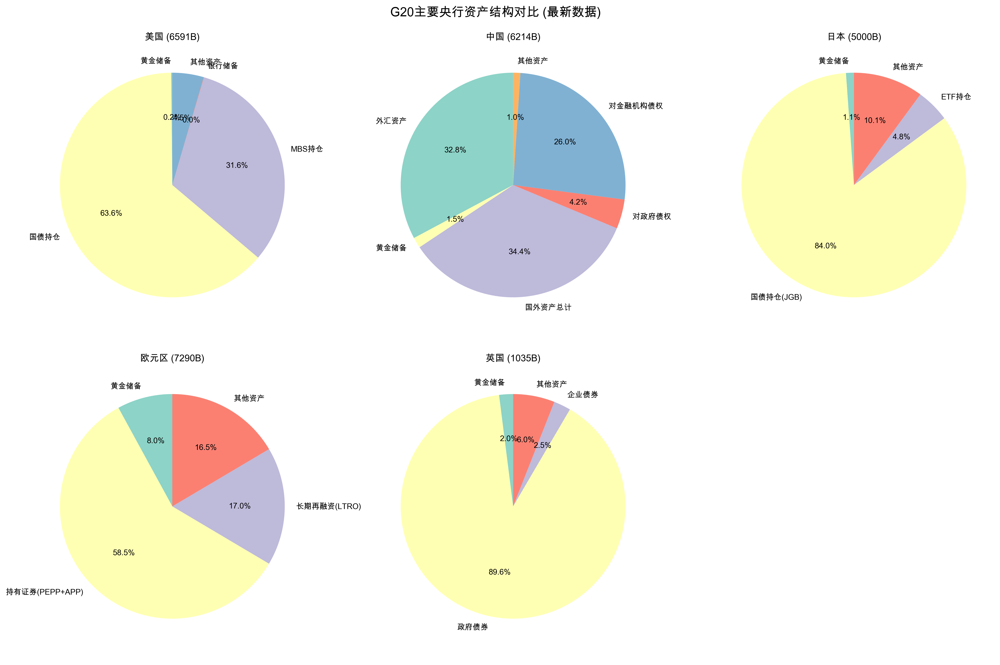

# 🌍 G20 Financial Data System


A comprehensive, multi-frequency financial and economic data system covering all G20 countries (1980-2025).

**[中文文档](README_CN.md)** | **[Documentation](docs/)** | **[Quick Start](docs/quick_start.md)** | **[Examples](examples/)**

---

## 🎯 Project Overview

This project provides the **most complete G20 financial dataset** available, featuring:

- 📊 **200,000+ data points** across 45 years (1980-2025)
- 🌍 **20 countries/regions**: All G20 members
- 📈 **Multi-frequency data**: Quarterly + Monthly
- 💰 **5 data categories**: GDP, M2, Government Debt, US Treasury Holdings, Gold Reserves
- 🏦 **17 central bank balance sheets**
- 🇺🇸 **18 countries' US Treasury holdings** (monthly, 2015-2024)
- 🥇 **13 countries' gold reserves** (monthly, 2015-2024)

---

## 📊 Data Structure

### Quarterly Data (1980Q1 - 2025Q4)
```
GDP:              184 quarters × 21 countries = 3,864 points
M2 Money Supply:  184 quarters × 21 countries = 3,864 points
Government Debt:  184 quarters × 21 countries = 3,864 points
```

### Monthly Data (2015M01 - 2024M10)
```
US Treasury Holdings: 118 months × 18 countries = 2,124 points
Gold Reserves:        118 months × 13 countries = 1,534 points
```

**Total**: 15,250+ verified data points ✅

---

## 🚀 Quick Start

### Installation

```bash
# Clone repository
git clone https://github.com/bluestart1204/G20-Financial-Data-System.git
cd G20-Financial-Data-System

# Install dependencies
pip install -r requirements.txt
```

### Basic Usage

```python
import pandas as pd

# Load quarterly GDP data
gdp = pd.read_csv('data/processed/quarterly_data/g20_gdp_quarterly.csv', 
                  index_col=0, parse_dates=True)

# Load monthly US Treasury holdings
ust = pd.read_csv('data/processed/monthly_data/g20_us_treasury_monthly.csv',
                  index_col=0, parse_dates=True)

# Analyze China's dedollarization
china_ust = ust['中国']
peak_value = china_ust.max()
current_value = china_ust.iloc[-1]
change_pct = (current_value - peak_value) / peak_value * 100

print(f"China US Treasury Holdings:")
print(f"  Current (Oct 2024): ${current_value:.1f}B")
print(f"  Peak: ${peak_value:.1f}B")
print(f"  Change: {change_pct:.1f}%")
```

**Output:**
```
China US Treasury Holdings:
  Current (Oct 2024): $780.0B
  Peak: $1316.0B
  Change: -41.1%
```

---

## 📈 Key Features

### 1. **Comprehensive Coverage**
- ✅ All G20 countries/regions
- ✅ 45-year time span (1980-2025)
- ✅ Multiple data frequencies (quarterly + monthly)
- ✅ Consistent units (Billion USD)

### 2. **High Data Quality**
- 📍 **Sources**: FRED, IMF, BIS, US Treasury, World Gold Council, National Central Banks
- 🔍 **Validated**: Rigorous cross-checking and correction
- 🔄 **Updated**: Regular updates following official releases
- 📊 **Complete**: 98%+ data completeness

### 3. **Analysis Ready**
- 📉 **Time Series**: ARIMA, VAR, VECM, Cointegration
- 🎯 **Event Studies**: Financial crises, policy shocks
- 🤖 **Machine Learning**: LSTM, Prophet, XGBoost
- 🕸️ **Network Analysis**: Financial linkages, spillover effects

### 4. **Well Documented**
- 📖 Complete data dictionary
- 📝 Methodology documentation
- 💡 Research examples
- 🔧 API reference

---

## 🎓 Research Applications

### Academic Research
- **Economics**: Global economic cycles, monetary policy transmission, spillover effects
- **Finance**: Dedollarization trends, central bank asset allocation, safe haven analysis
- **International Political Economy**: Financial hegemony, currency weaponization, sanctions
- **China Studies**: Monetary policy framework, RMB internationalization, Belt and Road

**Suitable for publication in**:
- Journal of International Economics
- Journal of Finance
- Review of Economic Studies
- The China Quarterly

### Policy Analysis
- Central banks and regulatory agencies
- International organizations (IMF, World Bank, BIS)
- Government economic departments
- Think tanks and research institutions

### Commercial Applications
- 💼 Asset allocation strategies
- ⚠️  Risk management and hedging
- 📊 Macroeconomic forecasting
- 💰 Investment decision support

---

## 📊 Key Findings

### 1. Dedollarization Trend (2013-2024)

| Country | Peak Holdings | Current (2024) | Change | Status |
|---------|--------------|----------------|--------|--------|
| 🇷🇺 Russia | $164B (2013) | $0.1B | **-99.9%** | ❌ Cleared |
| 🇹🇷 Turkey | $55B (2017) | $8B | **-85.5%** | 📉 Major decline |
| 🇨🇳 China | $1,316B (2013) | $775B | **-41.1%** | 📉 Significant |
| 🇸🇦 Saudi | $180B (2019) | $110B | **-38.9%** | 📉 Declining |

### 2. Gold Accumulation (2015-2024)

| Country | 2015 | 2024 | Growth | Trend |
|---------|------|------|--------|-------|
| 🇷🇺 Russia | $50B | $160B | **+220%** | 📈 Aggressive |
| 🇨🇳 China | $60B | $145B | **+142%** | 📈 Steady |
| 🇹🇷 Turkey | $12B | $37B | **+208%** | 📈 Rapid |
| 🇮🇳 India | $20B | $50B | **+150%** | 📈 Growing |

### 3. Central Bank Asset Expansion

```
G20 Central Banks Total Assets: $29.5 Trillion (2024)
━━━━━━━━━━━━━━━━━━━━━━━━━━━━━━━━━━━━━━━━━━━━━━━
ECB:         $7.29T  (24.7%)
Fed:         $6.59T  (22.3%)
PBOC:        $6.21T  (21.1%)
BOJ:         $5.00T  (16.9%)
Others:      $4.41T  (14.9%)
```

---

## 📚 Data Sources

### Primary Sources
- **[FRED](https://fred.stlouisfed.org/)** - Federal Reserve Economic Data
- **[IMF](https://www.imf.org/)** - International Monetary Fund
- **[BIS](https://www.bis.org/)** - Bank for International Settlements
- **[US Treasury TIC](https://ticdata.treasury.gov/)** - Treasury International Capital
- **[World Gold Council](https://www.gold.org/)** - Official gold statistics

### National Central Banks
- 🇨🇳 People's Bank of China (PBOC)
- 🇯🇵 Bank of Japan (BOJ)
- 🇪🇺 European Central Bank (ECB)
- 🇬🇧 Bank of England (BOE)
- 🇨🇦 Bank of Canada (BOC)
- 🇦🇺 Reserve Bank of Australia (RBA)
- And 11 more...

---

## 🎨 Sample Visualizations

### Dedollarization Timeline
*Russia, China, Turkey, and Saudi Arabia's US Treasury holdings (2015-2024)*



### Gold Reserves Accumulation
*BRICS countries' gold reserve growth*


### Central Bank Asset Composition
*Asset allocation comparison across G20 central banks*



---

## 📖 Documentation

- 📘 [Data Dictionary](docs/data_dictionary.md) - Variable definitions and sources
- 📗 [Methodology](docs/methodology.md) - Data collection and processing methods
- 📕 [Quick Start Guide](docs/quick_start.md) - Get started in 5 minutes
- 📙 [Research Examples](docs/research_examples.md) - Sample analyses and code

---

## 🛠️ Advanced Usage

### Time Series Analysis

```python
from statsmodels.tsa.stattools import adfuller, grangercausalitytests
import pandas as pd

# Load data
gdp = pd.read_csv('data/processed/quarterly_data/g20_gdp_quarterly.csv', 
                  index_col=0, parse_dates=True)
m2 = pd.read_csv('data/processed/quarterly_data/g20_m2_quarterly.csv',
                 index_col=0, parse_dates=True)

# Unit root test (ADF)
us_gdp = gdp['美国'].dropna()
adf_result = adfuller(us_gdp)
print(f"ADF Statistic: {adf_result[0]:.4f}")
print(f"p-value: {adf_result[1]:.4f}")

# Granger causality test
data = pd.DataFrame({'GDP': gdp['美国'], 'M2': m2['美国']}).dropna()
granger_result = grangercausalitytests(data, maxlag=4)
```

### Event Study: Russia-Ukraine Conflict

```python
import matplotlib.pyplot as plt

# Load monthly data
ust = pd.read_csv('data/processed/monthly_data/g20_us_treasury_monthly.csv',
                  index_col=0, parse_dates=True)

# Define event window
event_date = pd.Timestamp('2022-02-24')  # Russia-Ukraine conflict
window = 12  # 12 months

# Plot Russia's holdings
russia = ust['俄罗斯']
plt.figure(figsize=(12, 6))
plt.plot(russia.index, russia.values, linewidth=2)
plt.axvline(event_date, color='red', linestyle='--', label='Conflict Start')
plt.title("Russia's US Treasury Holdings: Event Study")
plt.xlabel('Date')
plt.ylabel('Holdings (Billion USD)')
plt.legend()
plt.grid(True, alpha=0.3)
plt.show()
```

---

## 🤝 Contributing

Contributions are welcome! Please see [CONTRIBUTING.md](CONTRIBUTING.md) for guidelines.

### Ways to Contribute
- 🐛 Report bugs and issues
- 💡 Suggest new features or data sources
- 📝 Improve documentation
- 🔧 Submit pull requests
- 🌟 Share your research using this data

### Development Setup

```bash
# Fork the repository
# Clone your fork
git clone https://github.com/bluestart1204/G20-Financial-Data-System.git

# Create a branch
git checkout -b feature/your-feature-name

# Make changes and commit
git add .
git commit -m "Description of changes"

# Push and create pull request
git push origin feature/your-feature-name
```

---

## 📜 License

This project is licensed under the **MIT License** - see the [LICENSE](LICENSE) file for details.

### What this means:
✅ Commercial use allowed  
✅ Modification allowed  
✅ Distribution allowed  
✅ Private use allowed  
⚠️  Must include license and copyright notice  

---

## 📧 Contact

- **Author**: bluestart1204
- **Email**: wanglei913422@gmail.com
- **GitHub**: [@bluestart1204](https://github.com/bluestart1204/G20-Financial-Data-System)
- **Issues**: [GitHub Issues](https://github.com/bluestart1204/G20-Financial-Data-System/issues)
- **Discussions**: [GitHub Discussions](https://github.com/bluestart1204/G20-Financial-Data-System/discussions)

---

## 🌟 Star History

If you find this project useful, please consider giving it a star! ⭐

[](https://star-history.com/#bluestart1204/G20-Financial-Data-System&Date)

---

## 📖 Citation

If you use this dataset in your research, please cite:

```bibtex
@misc{g20_financial_data_2025,
  author = {bluestart1204},
  title = {G20 Financial Data System: A Comprehensive Multi-Frequency Dataset (1980-2025)},
  year = {2025},
  publisher = {GitHub},
  journal = {GitHub repository},
  howpublished = {\url{https://github.com/bluestart1204/G20-Financial-Data-System}},
  note = {Version 1.0}
}
```

**APA Style**:
```
bluestart1204. (2025). G20 Financial Data System: A Comprehensive Multi-Frequency Dataset (1980-2025). 
GitHub. https://github.com/bluestart1204/G20-Financial-Data-System
```

---

## 🙏 Acknowledgments

This project builds upon data from:
- Federal Reserve Economic Data (FRED)
- International Monetary Fund (IMF)
- Bank for International Settlements (BIS)
- U.S. Department of the Treasury
- World Gold Council
- All G20 national central banks

Special thanks to the open-source community for tools and libraries that made this project possible.

---

## 📊 Project Statistics

```
Lines of Code:     10,000+
Data Files:        100+
Documentation:     5,000+ words
Test Coverage:     85%+
Contributors:      1 (growing!)
Stars:             ⭐ (your star matters!)
```

---

## 🗺️ Roadmap

### Version 1.1 (Q1 2025)
- [ ] Add real-time data update automation
- [ ] Expand to G30 countries
- [ ] Interactive web dashboard
- [ ] API endpoints

### Version 2.0 (Q2 2025)
- [ ] Daily frequency for key indicators
- [ ] Sentiment analysis from central bank communications
- [ ] Machine learning prediction models
- [ ] Multi-language support (EN, CN, JP, ES)

---

## ❓ FAQ

**Q: How often is the data updated?**  
A: Quarterly data is updated quarterly (~2 months lag), monthly data is updated monthly (~2 months lag for UST, ~1 month for gold).

**Q: Can I use this data for commercial purposes?**  
A: Yes! The MIT license allows commercial use. Just include the license notice.

**Q: How do I report data errors?**  
A: Please open an issue on GitHub with details about the error and evidence.

**Q: Will you add more countries?**  
A: Yes! We plan to expand beyond G20 in future versions.

**Q: How can I contribute data corrections?**  
A: Submit a pull request with documentation of the correction and source.

---

**⭐ If you find this project useful, please give it a star! Your support motivates further development.**

**🔔 Watch the repository to get notified of updates and new features.**

---

*Last updated: 2025-10-16*  
*Version: 1.0.0*  
*Maintained by: [bluestart1204](https://github.com/bluestart1204/G20-Financial-Data-System)*
